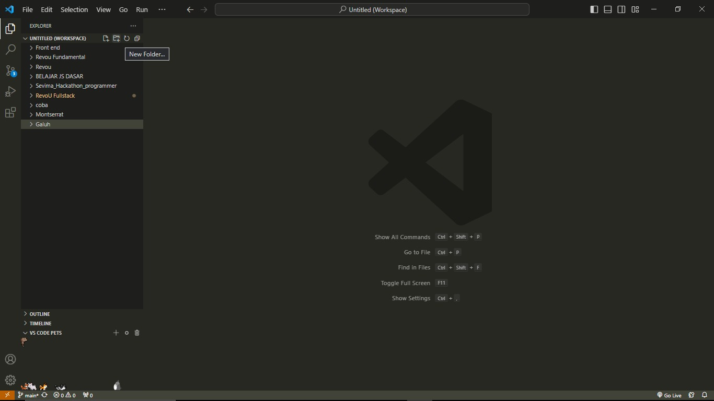
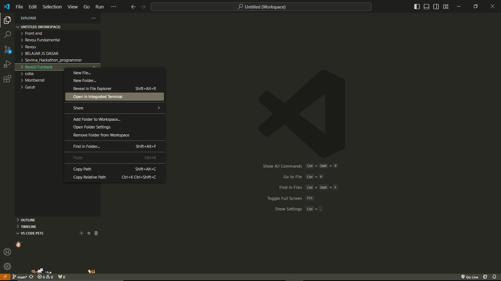
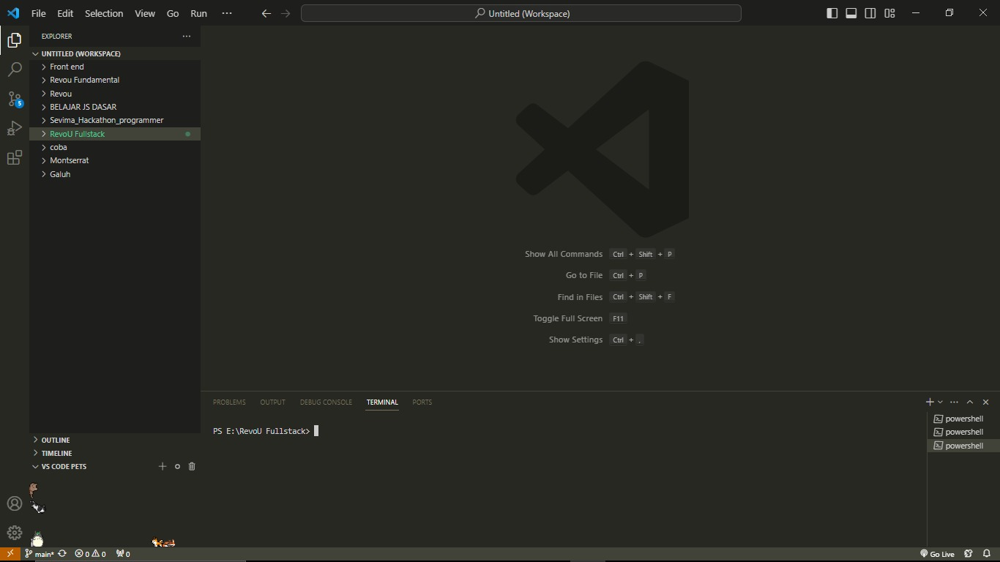
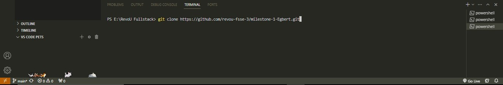
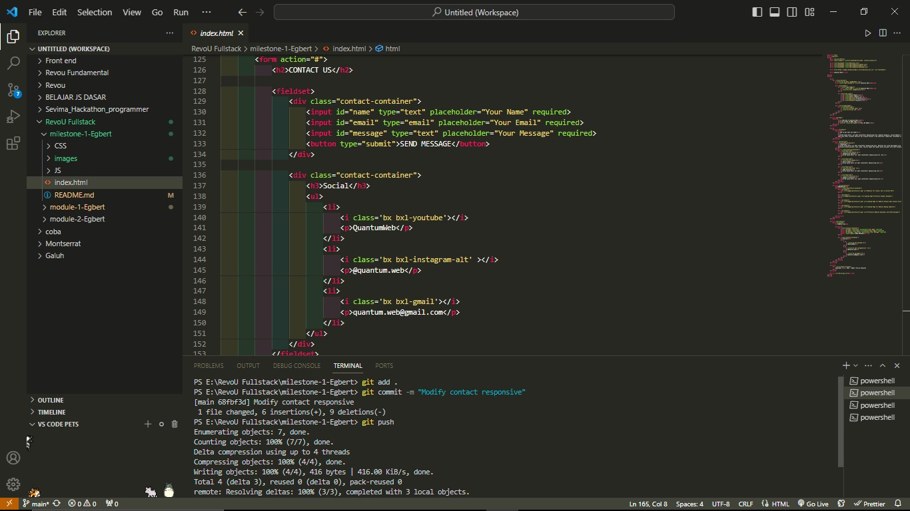

# Documentation of Milestone 1

## Getting an Idea

Create a company profile website with a website creation theme. I created a profile of the company Quantum Web that makes websites public

### Access to Quantum Web

- Netlify app :
- Domain : 

### Project Description

Quantum Web is a company engaged in the field of web developers. The company offers display orders for websites as well as displays data using Golang, JavaScript, PHP, C++. In working on client secrets are maintained so that they are safe from attacks from outside.

## Starting a Project

### Cloning File

- Open VS Code
- Create new folder

- Right-click on the folder

- Click "Open in Integrated Terminal"

- Write git clone paste the link https:// from the respository

- And enter

### Push File

- Open terminal in VS Code
- git add .
- git commit -m "Your message"
- git push

## Deploy the Web Project

### Connect Githu to Netlify

- Open Netlify and in Sites section choose add new site and import an existing project.
- Choose which repository you want to connect with Netlfy.
- Deploy the repository, wait until the process done and your project ready to open use the Netlify site.

### Connect Netlify to Domain

